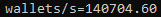

# EVM Crypto Bruteforce

> Based on the original repository [cdw1p/evm-crypto-bruteforce](https://github.com/cdw1p/evm-crypto-bruteforce), with the following main changes:
> - optional GPU acceleration for much higher address-generation throughput;
> - local Ethereum node support, which removes dependence on third-party RPC rate limits;
> - a performance jump from roughly 100 requests/s to well above 100,000 wallets/s in local testing, depending on hardware and node performance.

`evm-crypto-bruteforce` is a high-throughput C++/CUDA engine that:

1. generates random secp256k1 private keys,
2. derives Ethereum addresses,
3. queries an Ethereum node in JSON-RPC batches (`eth_getBalance` plus token `eth_call` requests for USDC and USDT),
4. reports wallets with non-zero balances.

<p align="center">
  
</p>

## Legal and safety notice

- This software is for research, testing, and benchmarking in lawful environments only.
- Working on private keys that do not belong to you without authorization is unlawful and unethical.
- The `wallets.txt` file stores private keys in plaintext, so it must be treated as highly sensitive data.
- Do not expose public RPC endpoints without proper hardening, firewalling, and authentication.

## What the program does

- Private-key generation: Windows cryptographic RNG via `BCryptGenRandom`.
- Public-key derivation: OpenSSL secp256k1 on the CPU.
- Optional GPU pipeline: CUDA-based secp256k1 plus Keccak, validated against the CPU path at startup.
- On-chain queries:
  - `eth_getBalance` for native ETH
  - `eth_call` with `balanceOf(address)` for:
    - USDC mainnet: `0xA0b86991c6218b36c1d19D4a2e9Eb0cE3606eB48`
    - USDT mainnet: `0xdAC17F958D2ee523a2206206994597C13D831ec7`
- Token query optimization:
  - tries `Multicall2 aggregate` at `0x5ba1e12693dc8f9c48aad8770482f4739beed696`
  - falls back automatically to direct `eth_call` requests if the probe fails
- Continuous multi-threaded runtime with periodic `[STATS]` output and clean shutdown on `Ctrl+C`

## Architecture at a glance

1. Each worker generates `N` valid secp256k1 private keys.
2. If `CONFIG_FORCE_ADDRESS` is empty, the program derives real addresses; otherwise it reuses the configured address for every query batch.
3. It builds a single JSON-RPC batch request for ETH plus token checks.
4. It sends the request through `WinHTTP` with keep-alive enabled.
5. It parses results by `id`, computes `hasBalance`, prints `[FOUND]`, and appends hits to `wallets.txt`.
6. It updates shared atomic statistics.

## Repository structure

```text
.
|-- .gitignore
|-- README.md
|-- image01.png
|-- evm-crypto-bruteforce.sln
`-- evm-crypto-bruteforce/
    |-- main.cpp
    |-- cuda_keccak.cu
    |-- cuda_keccak.h
    |-- evm-crypto-bruteforce.vcxproj
    |-- evm-crypto-bruteforce.vcxproj.filters
    `-- evm-crypto-bruteforce.vcxproj.user
```

## Full environment

### 1) Host environment for build and execution

Recommended baseline:

- OS: Windows 10/11 x64
- IDE: Visual Studio 2022
- Toolset: `v143`
- C/C++ language standard: `std:c++latest` (as configured in the project)
- Windows SDK: 10.0
- OpenSSL: provided by `vcpkg`
- CUDA Toolkit: 13.2 for the CUDA-enabled x64 build
- NVIDIA GPU: required only for the CUDA path

Project-file notes:

- The `.vcxproj` currently imports `CUDA 13.2.props` and `CUDA 13.2.targets`.
- The CUDA code-generation setting is `compute_89,sm_89`. If your GPU architecture or toolkit version differs, update the project settings before building.
- The Visual Studio `vcpkg` integration in the project file is configured for the `x64-windows` triplet. If you use a different triplet locally, adjust the project settings accordingly.

Example host dependency setup:

```powershell
git clone https://github.com/microsoft/vcpkg C:\vcpkg
C:\vcpkg\bootstrap-vcpkg.bat
C:\vcpkg\vcpkg.exe install openssl:x64-windows
C:\vcpkg\vcpkg.exe integrate install
```

### 2) Ethereum node environment (Docker + Geth + Lighthouse)

`evm-crypto-bruteforce` uses HTTP JSON-RPC at `http://127.0.0.1:8545` and expects a local Geth endpoint.

For Ethereum mainnet, Geth must be paired with a consensus client such as Lighthouse. A synced local node still requires internet connectivity to stay up to date; the advantage here is that the scanner does not depend on a third-party RPC provider or public rate limits.

Recommended stack:

- Geth (Execution Layer)
- Lighthouse (Consensus Layer)

#### 2.1 Docker prerequisites

- Docker Desktop installed and running
- Virtualization and/or WSL2 enabled
- A fast SSD with a large storage budget; mainnet EL + CL data can grow well past 1 TB over time

Pull the images used by the stack:

```powershell
docker pull ethereum/client-go:stable
docker pull sigp/lighthouse:latest
```

#### 2.2 Prepare directories and JWT secret

```powershell
New-Item -ItemType Directory -Force .\infra\geth, .\infra\lighthouse, .\infra\jwt | Out-Null

$bytes = New-Object byte[] 32
[System.Security.Cryptography.RandomNumberGenerator]::Fill($bytes)
($bytes | ForEach-Object { $_.ToString("x2") }) -join "" |
  Set-Content -NoNewline .\infra\jwt\jwt.hex
```

#### 2.3 Full `docker-compose.yml`

```yaml
services:
  geth:
    image: ethereum/client-go:stable
    container_name: evm-crypto-bruteforce-geth
    restart: unless-stopped
    command:
      - --syncmode=snap
      - --http
      - --http.addr=0.0.0.0
      - --http.port=8545
      - --http.api=eth,net,web3
      - --http.vhosts=*
      - --authrpc.addr=0.0.0.0
      - --authrpc.port=8551
      - --authrpc.vhosts=*
      - --authrpc.jwtsecret=/jwt/jwt.hex
      - --datadir=/data
      - --cache=4096
      - --maxpeers=80
    volumes:
      - ./infra/geth:/data
      - ./infra/jwt/jwt.hex:/jwt/jwt.hex:ro
    ports:
      - "127.0.0.1:8545:8545"
      - "30303:30303/tcp"
      - "30303:30303/udp"

  lighthouse:
    image: sigp/lighthouse:latest
    container_name: evm-crypto-bruteforce-lighthouse
    restart: unless-stopped
    depends_on:
      - geth
    command:
      - lighthouse
      - bn
      - --network
      - mainnet
      - --datadir
      - /data
      - --checkpoint-sync-url
      - https://mainnet.checkpoint.sigp.io
      - --execution-endpoint
      - http://geth:8551
      - --execution-jwt
      - /jwt/jwt.hex
      - --http
      - --http-address
      - 0.0.0.0
    volumes:
      - ./infra/lighthouse:/data
      - ./infra/jwt/jwt.hex:/jwt/jwt.hex:ro
    ports:
      - "127.0.0.1:5052:5052"
      - "9000:9000/tcp"
      - "9000:9000/udp"
      - "9001:9001/udp"
```

#### 2.4 Start the stack

```powershell
docker compose up -d
docker compose logs -f geth
docker compose logs -f lighthouse
```

#### 2.5 Quick health checks

```powershell
# Execution-layer JSON-RPC
curl -s -X POST http://127.0.0.1:8545 `
  -H "Content-Type: application/json" `
  -d "{\"jsonrpc\":\"2.0\",\"id\":1,\"method\":\"eth_blockNumber\",\"params\":[]}"

# Consensus-layer Beacon API
curl -s http://127.0.0.1:5052/eth/v1/node/syncing
```

#### 2.6 Why these flags

Geth:

- `--syncmode=snap`: fast sync mode suitable for an operational full node
- `--http` + `--http.addr=0.0.0.0` + `--http.port=8545`: exposes the standard RPC endpoint used by this project
- `--http.api=eth,net,web3`: minimum API surface required by the current implementation
- `--authrpc.*` + `--authrpc.jwtsecret`: authenticated Engine API endpoint for the consensus client
- `--datadir=/data`: persists chain data on the host volume
- `--cache=4096`: improves sync and query performance at the cost of RAM
- `--maxpeers=80`: keeps a healthy peer set for stable syncing

Lighthouse:

- `bn --network mainnet`: runs a mainnet beacon node
- `--checkpoint-sync-url ...`: speeds up initial sync compared with starting from genesis
- `--execution-endpoint http://geth:8551`: internal EL/CL connection inside the Docker network
- `--execution-jwt /jwt/jwt.hex`: shared JWT authentication with Geth
- `--http --http-address 0.0.0.0`: exposes the Beacon API for local monitoring

## Building the project

### Option A: Visual Studio

1. Open `evm-crypto-bruteforce.sln`.
2. Select `Release | x64`.
3. Build the solution.

Typical output: `x64\Release\evm-crypto-bruteforce.exe`.

### Option B: MSBuild CLI

```powershell
msbuild .\evm-crypto-bruteforce.sln /m /p:Configuration=Release /p:Platform=x64
```

## Runtime configuration

The program does **not** parse CLI arguments. Configuration is controlled through compile-time macros plus environment variables.

### Compile-time macros (`main.cpp`)

| Macro | Default | Purpose |
|---|---|---|
| `CONFIG_FORCE_ADDRESS` | `""` | If set, all balance queries target the same address. Useful for smoke tests; real address derivation is skipped. |
| `CONFIG_RPC_URL` | `http://127.0.0.1:8545` | Geth RPC endpoint. |
| `CONFIG_WORKER_THREADS` | `80` | Number of concurrent workers. |
| `CONFIG_WALLETS_PER_BATCH` | `200` | Wallets generated per worker batch. |
| `CONFIG_INFLIGHT_REQUESTS` | `3` | Concurrent HTTP requests per worker. |
| `CONFIG_STATS_INTERVAL_SECONDS` | `10` | `[STATS]` print interval. |
| `CONFIG_REQUEST_TIMEOUT_MS` | `15000` | WinHTTP request timeout in milliseconds. |
| `CONFIG_FOUND_WALLETS_FILE` | `wallets.txt` | Append-only file used to store hits. |
| `CONFIG_MULTICALL2_ADDRESS` | `0x5ba1...d696` | Multicall2 contract probed at startup for token-query aggregation. |

### Supported environment variables

| Variable | Default | Runtime clamp |
|---|---|---|
| `ETH_WORKER_THREADS` | `80` | `1..256` |
| `ETH_WALLETS_PER_BATCH` | `200` | `1..4096` |
| `ETH_MULTICALL_WALLETS_PER_CALL` | same as batch size (`200` by default) | `1..4096` |
| `ETH_INFLIGHT_REQUESTS` | `3` | `1..16` |
| `ETH_STATS_INTERVAL_SECONDS` | `10` | `1..3600` |
| `ETH_REQUEST_TIMEOUT_MS` | `15000` | `1000..300000` |

## Running `evm-crypto-bruteforce`

Conservative example:

```powershell
.\x64\Release\evm-crypto-bruteforce.exe
```

Expected startup messages include:

- `RPC URL: http://127.0.0.1:8545`
- `Address pipeline: CUDA ...` or `CPU fallback: ...`
- `Token query pipeline: Multicall2 ...` or `Direct eth_call ...`
- `Continuous loop started. Press Ctrl+C to stop.`

## Output and logs

Console:

- `[FOUND][wX] ...` when at least one of ETH, USDC, or USDT is non-zero
- `[STATS] ...` with throughput, error counters, and average per-batch timing

File output:

- `wallets.txt`, appended with:
  - address
  - private key
  - formatted ETH, USDC, and USDT balances

## Performance tuning

- Increase `ETH_WORKER_THREADS` until CPU or RPC saturation starts producing too many `errors`.
- Balance `ETH_WALLETS_PER_BATCH` with `ETH_INFLIGHT_REQUESTS` to reduce overhead without overloading the node.
- If GPU mode is active, watch:
  - `addr_gpu_batches`
  - `cuda_fallbacks`
  - `avg_gpu_keys/dispatch`
- If Geth is under pressure, reduce concurrency or increase `ETH_REQUEST_TIMEOUT_MS`.

## Troubleshooting

- RPC connection error:
  - verify `docker compose ps`
  - confirm the `127.0.0.1:8545` bind
  - test `eth_blockNumber` manually with `curl`
- `Token query pipeline: Direct eth_call (fallback)`:
  - Multicall2 is missing, unreachable, or returned an invalid response
  - verify that the node is on mainnet and fully synced
- `CPU fallback: CUDA runtime not available`:
  - the CUDA toolkit or driver is missing, or the build/runtime configuration does not match the local GPU
- No `[FOUND]` output:
  - this is normal; the key space is enormous
  - for a functional smoke test, use `CONFIG_FORCE_ADDRESS` with a known address
- USDC and USDT are always `0`:
  - the node is probably on the wrong network or not fully synced

## License and responsibility

Unless stated otherwise, treat this repository as experimental software provided without warranties.
Operational security, legal compliance, and secret management remain the operator's responsibility.
